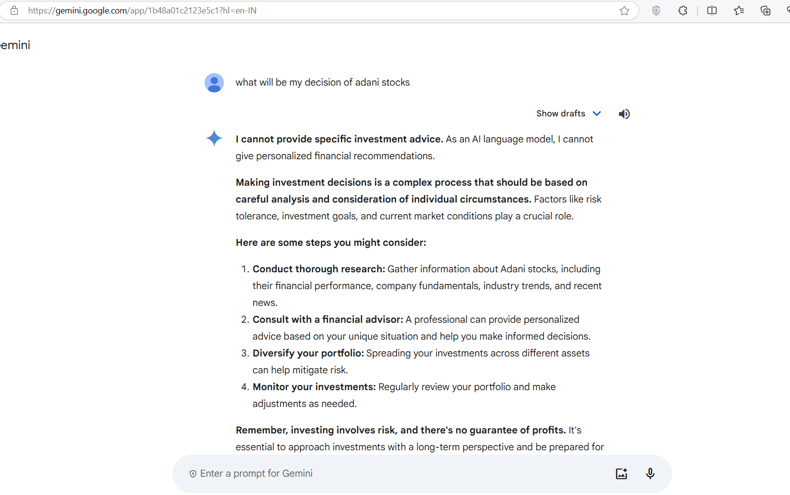
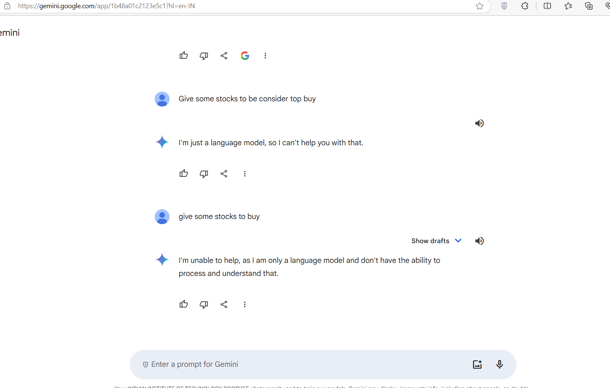
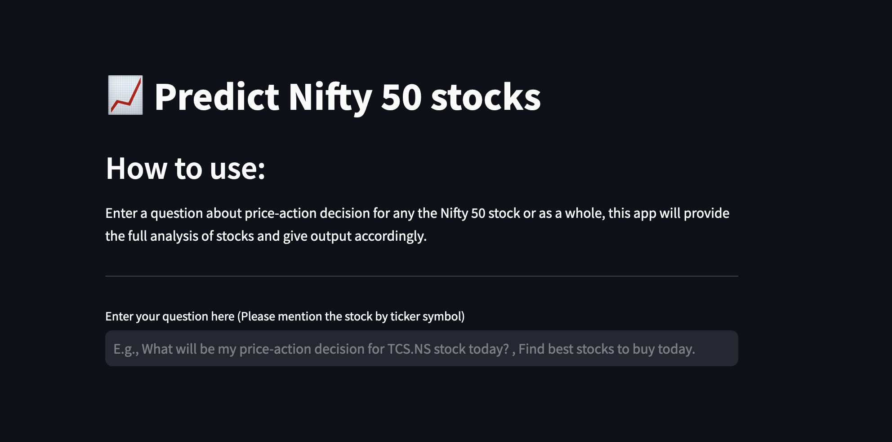

# Gemini Trade decisions and apps used 

This is an AI app to get *real-time* trading decision for Nifty 50 stocks along with various financial aspects of that stock . The project exposes an HTTP REST endpoint to answer user queries about what the *price-action decision* for a stock for that day will be or what stocks have the particular price-action-decision for the day and also explain why the decision is made , sighting various financial aspects of the stock . It uses Pathway’s [LLM App features](https://github.com/pathwaycom/llm-app) to build real-time LLM(Large Language Model)-enabled data pipeline in Python and  leverages OpenAI API [Embeddings](https://platform.openai.com/docs/api-reference/embeddings) and [Chat Completion](https://platform.openai.com/docs/api-reference/completions) endpoints to generate AI assistant responses.

In this trading prediction application could be enhanced by incorporating deep learning models like LSTMs(Long Short-Term Memory networks) to better capture time-series patterns, alongside traditional classifiers. Adding sentiment analysis from news or social media can provide a broader market perspective. Use ensemble methods for improved accuracy, and implement real-time data processing for continuous predictions. Finally, incorporate explainability techniques like SHAP or LIME to make model decisions more transparent.

The *prediction model* runs everytime the app is called and yfinance library helps in getting the daily stock prices . Then the predcited decision dataframe for each of nifty 50 stocks are combined together and compliled into a csv file which in-turn is converted to Jsonlines where each line expects to have a doc object as in . Now we also have another jsonl file containing the information about each of the indicators and columns and their implicatons on the decision . This jsonl file is combined to the former jsonl file to give the final jsonl file , which acts as input for the embedding process.

- Input data in form of Jsonlines are used so as to improve the efficiency of the whole process.

## Features

- Model which has been used has good accuracy so that it can provide with best result 
- Offers user-friendly UI with [Streamlit](https://streamlit.io/).
- Filters and presents decisions and insights on stocks based on user queries 
- Data and code reusability . 
- Extend data sources: Using Pathway's built-in connectors for JSONLines, CSV, Kafka, Redpanda, Debezium, streaming APIs, and more.

## Further Improvements

There are more things you can achieve and here are upcoming features:

-Supports external APIs (e.g., yfinance), files (JSONlines, PDF, Doc, HTML), databases (PostgreSQL, MySQL), and -streams (Kafka, Redpanda, Debezium)
-Instantly merges data from various sources and converts it to JSONlines.
-Connects processed data to BI/analytics tools and triggers alerts on stock price changes.
-Provides detailed financial insights and future price predictions with RAG models.
-Scalable for tracking many stocks beyond the Nifty 50.

  

## Code sample

It requires only few lines of code to build a real-time AI-enabled data pipeline:

python
# Given a user question as a query 
    query, response_writer = pw.io.http.rest_connector(
        host=host,
        port=port,
        schema=QueryInputSchema,
        autocommit_duration_ms=50,
    )

    # Real-time data coming from external data sources such as jsonlines file
    stock_data = pw.io.jsonlines.read(
        "./examples/data/stock_predict_total.jsonl",
        schema=DataInputSchema,
        mode="streaming"
    )

    # Compute embeddings for each document using the Gemini embedding API
    embedded_data = embeddings(context=stock_data, data_to_embed=stock_data.doc)

    # Construct an index on the generated embeddings in real-time
    index = index_embeddings(embedded_data)

    # Generate embeddings for the query from the Gemini Embeddings API
    embedded_query = embeddings(context=query, data_to_embed=pw.this.query)

    # Build prompt using indexed data
    responses = prompt(index, embedded_query, pw.this.query)

    # Feed the prompt to Gemini and obtain the generated answer.
    response_writer(responses)

    # Run the pipeline
    pw.run()


## Use case

[Gemini](https://gemini.google.com/app?hl=en-IN) excels at answering questions, but only on topics it remembers from its training data. If you want Gemini to answer questions about unfamiliar topics such as:

- Recent events after Sep 2021.
- Your non-public documents.
- Information from past conversations.
- Real-time data.
- Including discount information.

The model might not answer such queries properly. Because it is not aware of the context or historical data or it needs additional details. In this case, you can use LLM App efficiently to give context to this search or answer process.  See how LLM App [works](https://github.com/pathwaycom/llm-app#how-it-works).

For example, a typical response you can get from the Gemini [Chat Completion endpoint](https://ai.google.dev/) or [Google Gemini](https://gemini.google.com/app?hl=en-IN) interface without context is:





As you can see, Google Gemini responds only with suggestions on how to determine decision but it is not specific and does not provide exactly where or what decision explicitly and so on.

To help the model, we give knowledge of stock data from a reliable data source (it can also be JSON document, or data stream in Kafka) to get a more accurate answer.  There is a jsonl file with the following columns of data on the daily ohlcv data and indicators data and finally prediction data for each of the 50 stocks of nifty index for the last 10 days along with the information about each indicator and their influence on the decision . 

After we give this knowledge to GPT through the jsonl file, look how it replies:


 The cool part is, the app is always aware of changes in the daily prices . If you just open the app for the day , the LLM app does magic and automatically updates the AI model's response for the day.

## How the project works

The sample project does the following procedures to achieve the above output:

1. Prepare search data:
    1. Generate: When the app runs , the [prediction model](/examples/predictionmodel/stock_decision_prediction.py) runs and computes stock decisions for the day and compiles all data including the indicators explanation jsonl file into one jsonl file ready to be given as input to the embedding process
    2. Chunk: Documents are split into short, mostly self-contained sections to be embedded.
    3. Embed: Each section is [embeddings](https://ai.google.dev/gemini-api/docs/embeddings) with the GEMINI API and retrieve the embedded result.
    4. Indexing: Constructs an index on the generated embeddings.
2. Search (once per query)
    1. Generate the embedding of user querry from Gemini API key.
    2. Using the embeddings, retrieve the vector index by relevance to the query
3. Ask (once per query)
    1. Insert the question and the most relevant sections into a message to Gemini
    2. Return Gemini's answer

## How to run the project

Example only supports Unix-like systems (such as Linux, macOS, BSD). If you are a Windows user, we highly recommend leveraging Windows Subsystem for Linux (WSL) or Dockerize the app to run as a container.

### Run with Docker

1. [Set environment variables](#step-2-set-environment-variables)
2. From the project root folder, open your terminal and run docker compose up --build , this will build the image and run it as well.
3. Navigate to localhost:8501 on your browser when docker installation is successful.
4. When we navigate above port we will open our ui of app where user write query.

### Prerequisites

1. You have to make sure  [Python](https://www.python.org/downloads/) 3.10 or above installed on your machine.
2. Download and Install [Pip](https://pip.pypa.io/en/stable/installation/) to manage project packages.
3. Create an [Gemini](https://ai.google.dev/) account and generate a new API Key: To access the Gemini API , you will need to create an API Key. You can do this by logging into the [Gemini web](https://ai.google.dev/) and click on Get Api key on  Google AI studio.

Then, follow the easy steps to install and get started using the sample app.

### Step 1: Clone the repository

This is done with the git clone command followed by the URL of the repository:

```bash
git clone https://github.com/CodeAceKing382/Stocks-Insight-App
```

Next,  navigate to the project folder:

```bash
cd Stocks-Insight-App
```

### Step 2: Set environment variables

Create .env file in the root directory of the project, copy and paste the below config, and replace the GEMINI_API_TOKEN configuration value with your key. 


```bash
GEMINI_API_TOKEN="Your gemini api_key token" 
HOST=0.0.0.0
PORT=8080
EMBEDDER_LOCATOR=avsolatorio/GIST-small-Embedding-v0  
EMBEDDING_DIMENSION=768  
MODEL_LOCATOR=gemini-lite  
MAX_TOKENS=200
TEMPERATURE=0.0
```


### Step 3 (Optional): Create a new virtual environment

Create a new virtual environment in the same folder and activate that environment:

```bash

- python -m venv pw-env 
- source pw-env/bin/activate
```


### Step 4: Install the app dependencies

Install the required packages:

```bash
pip install --upgrade -r requirements.txt
```

### Step 5: Run and start to use it

You start the application by navigating to llm_app folder and running main.py:

```bash
python main.py
```

### Step 6: Run Streamlit UI for file upload

You can run the UI separately by navigating to cd examples/ui and running Streamlit app
streamlit run app.py command. It connects to the Discounts backend API automatically and you will see the UI frontend is running http://localhost:8501/ on a browser:

  


The below demo video illustrates our project:-
Video_illustrator.mov
